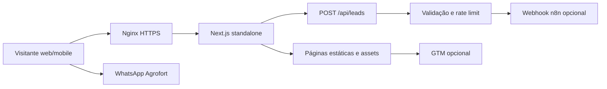
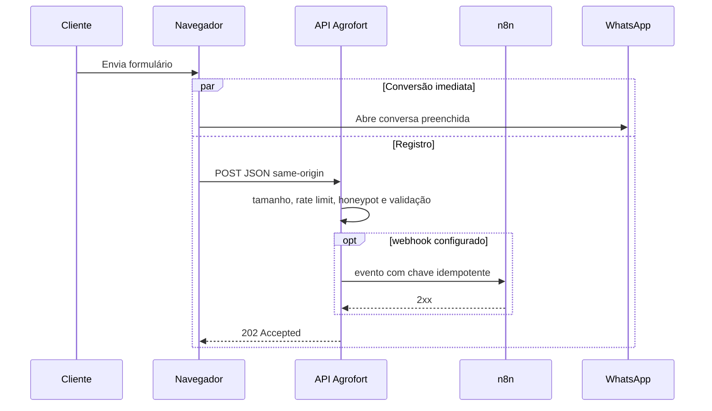

# Arquitetura

## Objetivo e limites

O sistema é uma vitrine institucional e catálogo de baixa escrita. Seu principal caso de uso é transformar descoberta em conversa comercial pelo WhatsApp. Não existe checkout, autenticação de cliente ou banco de dados local.

Foi mantido um monólito modular Next.js: é a opção proporcional ao domínio atual, reduz custo operacional e preserva separação entre UI, regras de entrada, integrações e infraestrutura.

## Visão de componentes

## Fronteiras

| Fronteira | Responsabilidade | Exemplos |
| --- | --- | --- |
| UI | apresentação, acessibilidade e eventos do usuário | `app/`, `components/dom/` |
| Visual | renderização 3D e movimento | `components/canvas/`, `components/animations/` |
| Domínio local | catálogo, configuração e contrato do lead | `lib/products.ts`, `lib/site.ts`, `lib/leads.ts` |
| Estado cliente | produto selecionado e preferência de movimento | `store/catalog.ts` |
| Entrada HTTP | validação, política e orquestração do webhook | `app/api/leads/route.ts` |
| Infraestrutura | contêiner, proxy, TLS, releases e rollback | `Dockerfile`, `docker-compose.yml`, `deploy/` |

O domínio não importa componentes React nem infraestrutura. O endpoint importa o contrato puro de leads; isso permite testá-lo sem subir Next.js ou n8n.

## Rotas

| Rota | Propósito | Renderização |
| --- | --- | --- |
| `/` | proposta de valor, produtos reais, premiações, fundadora e CTA | estática |
| `/catalogo` | catálogo interativo e perfil sensorial | estática + cliente/WebGL |
| `/premiacoes` | contexto das medalhas de 2025 | estática |
| `/sobre` | história, valores e origem | estática |
| `/contato` | canais e formulário para WhatsApp | estática + endpoint |
| `/privacidade` | transparência de dados | estática |
| `/api/leads` | captura server-side opcional | dinâmica |

## Fluxo de lead

O WhatsApp é o caminho crítico do usuário. A falha do n8n não impede a conversa. O backend registra somente estado técnico e nunca escreve nome, telefone ou mensagem nos logs.

## Desempenho visual

- o canvas do hero é carregado imediatamente;
- canvases abaixo da dobra são montados apenas até 280 px antes de entrar na viewport;
- mobile e `prefers-reduced-motion` usam DPR 1, sem antialias e sem sombra de contato;
- partículas e autoplay param quando ocultos ou fora da viewport;
- imagens usam `next/image`, tamanhos responsivos e carregamento preguiçoso;
- conteúdo essencial permanece em HTML, independente do WebGL.

## Decisões e evolução

- **Persistência:** desnecessária no MVP; o n8n/CRM é o sistema de registro.
- **Consistência:** entrega do webhook é no máximo duas tentativas; o receptor deve deduplicar por `X-Idempotency-Key`.
- **Escala:** o rate limiter em memória atende ao único processo. Para múltiplas réplicas, substituir por Redis.
- **CSP:** o uso atual de GTM e scripts gerados pelo Next exige `unsafe-inline`. A evolução recomendada é CSP com nonce.
- **3D real:** os objetos atuais são esculturas procedurais. GLB/Draco deve entrar como adapter visual, sem mudar o catálogo/domínio.
